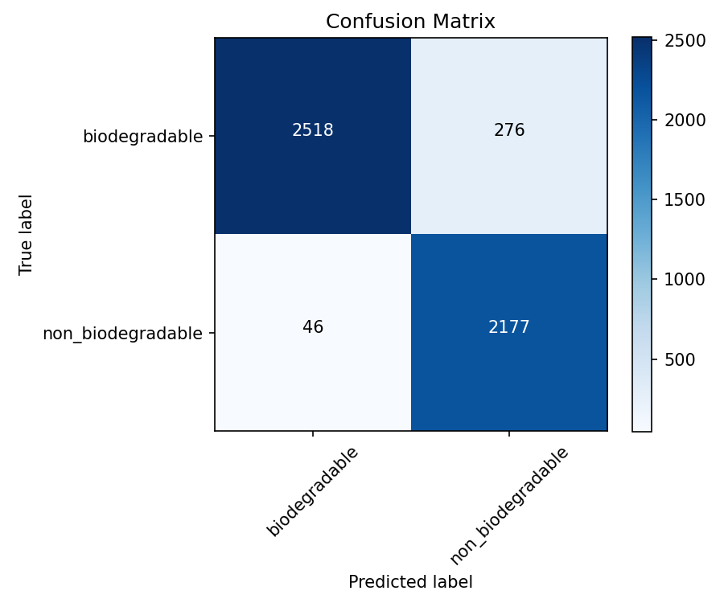

# ♻️ AI-Powered Waste Classification using Edge Impulse (BYOM)

> 🚀 **An Edge AI solution for sustainable waste management — classifying waste as Biodegradable or Non-Biodegradable directly on edge devices.**

---

## 🌍 Overview

This project aims to build an **AI-powered waste classification model** that can run **directly on edge devices** (without internet dependency) using **TensorFlow Lite** and **Edge Impulse’s Bring Your Own Model (BYOM)** feature.

By automating waste categorization at the source, this solution promotes efficient waste segregation, recycling, and cleaner environments — a step toward **smart cities and sustainable living** 🌱.

---

## 🧩 Problem Statement

Manual waste segregation is slow, inconsistent, and often inaccurate — especially at large-scale facilities.  
Our goal:  
- ✅ Automate classification into **Biodegradable** and **Non-Biodegradable** categories  
- ⚙️ Optimize model for **real-time edge inference** (low latency, low power)  
- 🌐 Use **Edge Impulse platform** for deployment, profiling, and testing  

---

## 🧠 Model Architecture

- **Base Model:** EfficientNetB0 (pretrained on ImageNet)
- **Layers:**
  - Global Average Pooling
  - Dropout (0.2)
  - Dense (128, ReLU)
  - Dense (2, Softmax)
- **Input Shape:** 128×128×3 (RGB)
- **Output Classes:** 2 (Biodegradable / Non-Biodegradable)
- **Framework:** TensorFlow / Keras  
- **Optimized Format:** TensorFlow Lite (Float + INT8 Quantized)

---

## 📊 Model & Training Details

| Parameter | Value |
|------------|--------|
| **Dataset Size** | ~45,000 images |
| **Split** | 80% Train / 10% Val / 10% Test |
| **Optimizer** | Adam (lr = 1e-4 → 1e-5) |
| **Loss Function** | Categorical Crossentropy |
| **Batch Size** | 32 |
| **Epochs** | 25 (Early Stopping ≈ 18) |
| **Augmentation** | Flip, Rotation, Zoom, Brightness |
| **Accuracy (Float)** | **93.12%** |
| **F1-Score** | **93.15%** |
| **Inference Time (INT8)** | **0.007s per image** |
| **Model Size (INT8)** | **≈ 4 MB** |

---

## ⚙️ Model Workflow (Data Flow)

1. 📸 **Image Capture:** Edge camera collects input (128×128 RGB)
2. 🧹 **Preprocessing:** Resize, Normalize (0–255)
3. 🧠 **Model Inference:** EfficientNetB0 with custom dense layers
4. 🧾 **Classification:** Predicts Biodegradable / Non-Biodegradable
5. 🔁 **Optimization:** Quantized to INT8 for on-device inference
6. 🌐 **Deployment:** BYOM integration on Edge Impulse

---

## 🧮 Evaluation Results

| Metric | Value |
|---------|--------|
| Accuracy | 93.12% |
| Precision | 0.93 |
| Recall | 0.94 |
| F1 Score | 0.93 |
| Avg Inference Time | 0.007s |

### 🔹 Confusion Matrix

---

## 🧰 Tools & Frameworks Used

| Category | Tools |
|-----------|-------|
| **Modeling** | TensorFlow, Keras, NumPy, Pandas |
| **Preprocessing** | OpenCV, ImageDataGenerator |
| **Visualization** | Matplotlib, Seaborn |
| **Deployment** | Edge Impulse (BYOM) |
| **Optimization** | TensorFlow Lite Converter |

---

## 🚀 Deployment Details

- ✅ **Platform:** Edge Impulse (Bring Your Own Model)  
- 🧠 **Uploaded Models:**  
  - `model_float_final_fixed.tflite`  
  - `model_int8_fixed.tflite`  
- ⚡ **Performance:**  
  - Smooth inference on browser & edge prototype  
  - Low latency and minimal memory usage  

📎 **Edge Impulse Project Link:**  
👉 *(Paste your Edge Impulse project link here)*  

---

## 💡 Key Highlights

- ⚙️ Optimized **EfficientNetB0-based CNN**  
- ⚡ **Quantized TFLite (INT8)** for efficient edge inference  
- 🧾 45K+ dataset used for robustness  
- 🌍 Focused on **sustainability & edge AI innovation**  
- 🧠 Fully integrated with **Edge Impulse BYOM pipeline**

---

## 📂 Repository Structure

